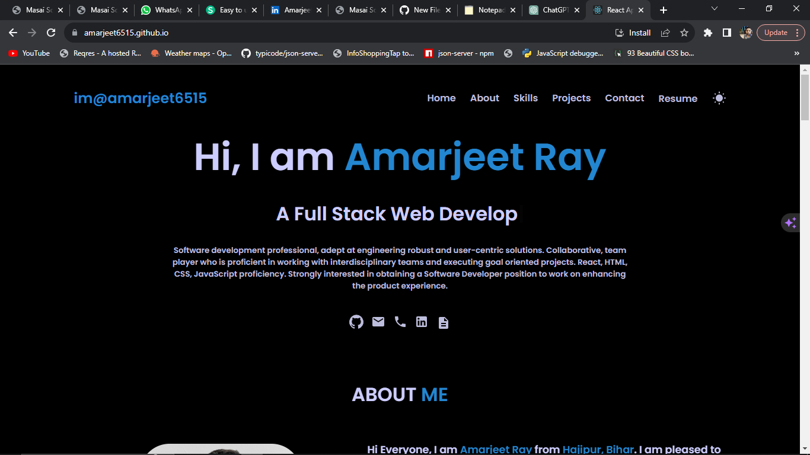
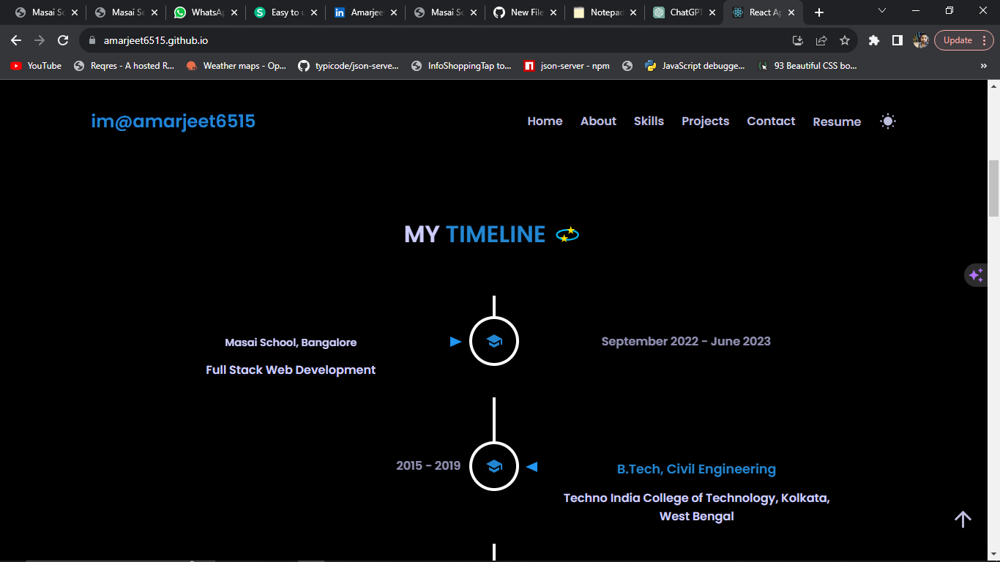
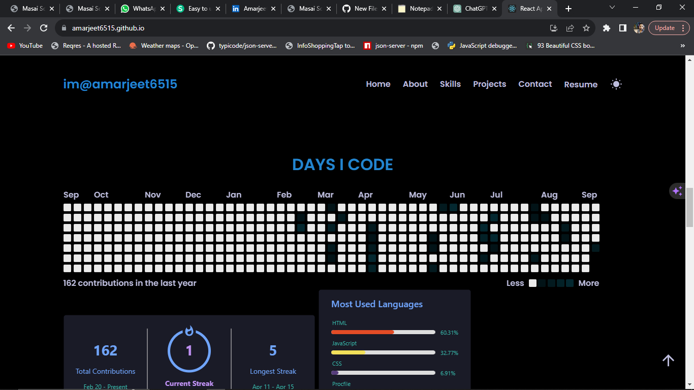

# amarjeet6515.github.io

This Portfolio WebApp is a dynamic and interactive website built using React.js. 
It serves as a platform for showcasing your projects, skills, and achievements in an aesthetically pleasing and user-friendly manner.
This readme provides a comprehensive guide to set up, customize, and deploy the web application.

## Deployment

The website is hosted on *github*

bash
  https://amarjeet6515.github.io/

## Features

Responsive Design: The web application is designed to be accessible and visually appealing on various screen sizes, including desktops, tablets, and mobile devices.

Project Showcase: Display my projects with detailed descriptions, images, and links to live demos or source code repositories.

Skills Section: Highlights my technical skills and proficiency in various technologies or programming languages.

About Me: Share a brief biography and introduce myself to visitors.

## Tech Stack

-  React
-  Chakra UI
-  CSS
- Hosting: Vercel

## Screenshots

Here are some screenshots of the Portfolio :

## Contact

Feel free to contact me at amarjeetray6515@gmail.com for any questions or inquiries.
